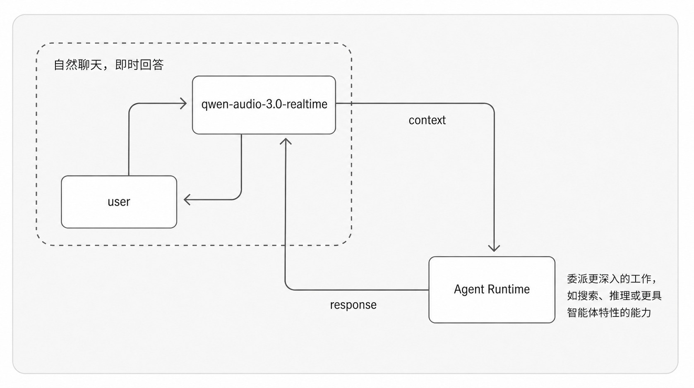

# qwen-audio-agent

## 让 Agent 开口说话

**自由对话，不被任务阻塞；无缝连接你已经在用的 Agent。**

qwen-audio-agent 是面向主流 Agent 的实时语音前台。你可以像通话一样持续说话、
随时打断，也可以直接用语音安排搜索、文件、代码和其他耗时工作。默认连接
OpenCode，也支持 OpenClaw，并为更多后台 Agent 保留统一的接入方式。

它不替代后台 Agent，而是让已有的模型、工具、MCP、Skill、权限和项目上下文，
自然进入实时语音对话。

## 对话继续，任务也在继续



Realtime 前台负责倾听、理解和表达。能直接回答的问题立即回答；需要外部信息、
工具或持续处理时，再把任务交给后台 Agent。

后台执行不会阻塞语音对话。你可以继续提出新要求、询问进度、修改方向或取消任务。
完成结果会在合适的时机回到当前上下文，由 Realtime 自然承接和播报。整个过程中，
用户面对的始终是同一个助理。

## 核心体验

- 像通话一样自由交流：全双工语音、自然打断、持续多轮对话
- 对话与任务互不阻塞：前台持续回应，后台继续执行
- 结果无缝回到上下文：可以追问、补充、修改和继续处理
- 连接现有 Agent 能力：延续工具、项目、记忆与工作习惯
- OpenCode 默认增强支持，并可切换 OpenClaw
- WebUI、终端 TUI 和 macOS 桌面悬浮球
- 本地用户档案和跨会话个人记忆

## 安装

需要 Node.js 22.22.2、24.15.0 或更高兼容版本、npm 10+ 和 DashScope API Key。
仓库提供 `.nvmrc` 和 `.node-version`；使用 nvm 时可直接运行 `nvm use`。

从 npm registry 安装已发布版本：

```bash
npm install -g qwen-audio-agent
```

尚未发布到当前 registry，或希望直接使用仓库版本时，从源码构建同一种 npm
成品：

```bash
git clone https://github.com/QwenAudio/qwen-audio-agent.git
cd qwen-audio-agent
npm install
npm run install:global
```

`install:global` 会构建 WebUI、生成临时 tarball，再将 tarball 安装为独立的
全局成品；不会把 `qwenaudio` 软链接到源码目录。

升级 registry 版本：

```bash
npm install -g qwen-audio-agent@latest
```

升级源码版本：

```bash
git pull
npm install
npm run install:global
```

## 快速开始

创建用户配置：

```bash
qwenaudio config
```

打开命令显示的 `config.env`，填写：

```dotenv
DASHSCOPE_API_KEY=your-key
```

启动 Gateway：

```bash
qwenaudio
```

`qwenaudio`、`qwenaudio gateway` 和 `qwenaudio gateway run` 都会在前台运行。
另开一个终端启动语音界面：

```bash
qwenaudio tui
```

minimal TUI 在 macOS 使用 CoreAudio 回声消除全双工；Linux 和 Windows 保持
同一个 minimal 界面并使用 `sounddevice`/PortAudio 半双工。半双工模式会在回复
播放期间暂停麦克风，播放结束后自动恢复，也可以按 `x` 手动打断。非 macOS
首次使用前请安装 `sounddevice`（并确保系统已安装 PortAudio）。

或者打开 WebUI：

```bash
qwenaudio webui
```

## macOS 桌面版

桌面版是常驻桌面的语音悬浮球，连接同一套 Gateway。桌面 UI 已包含在 `.app`
中，重新构建即可更新外观；Gateway 只提供 API、实时语音和后台 Agent 能力。
先按上面的步骤启动 Gateway，再从发布页下载 `.dmg`，打开后将
**Qwen Audio Agent** 拖入“应用程序”。

从源码生成仅供本机测试的未签名安装包：

```bash
npm run desktop:build:local
```

构建完成后，打开 `dist/desktop/` 中的 `.dmg`，将 **Qwen Audio Agent**
拖入“应用程序”即可。本地开发可直接运行 `npm run desktop`。

正式发布使用 `npm run desktop:build`。该命令要求 Apple Developer ID
签名与公证凭据，开启 hardened runtime，并为麦克风和网络访问应用最小权限。
签名使用 `CSC_LINK`/`CSC_KEY_PASSWORD`（或钥匙串中的 `CSC_NAME`）；公证使用
`APPLE_ID`、`APPLE_APP_SPECIFIC_PASSWORD`、`APPLE_TEAM_ID`，也可使用
`APPLE_API_KEY`、`APPLE_API_KEY_ID`、`APPLE_API_ISSUER`。

## 后台常驻

希望个人助理长期在线时，可以安装为用户后台服务：

```bash
qwenaudio gateway install
```

常用管理命令：

```bash
qwenaudio gateway status
qwenaudio gateway restart
qwenaudio gateway stop
qwenaudio gateway start
qwenaudio gateway uninstall
```

macOS 使用 `launchd`，Linux 使用 `systemd --user`。Gateway 和由它启动的后台
Agent 会被统一管理。

## 选择后台 Agent

默认使用 OpenCode 增强模式，无需额外配置。切换到 OpenClaw：

```dotenv
AGENT_PROTOCOL=openclaw
```

增强模式会为 qwen-audio-agent 启动独立的后台 Agent，同时保留用户已有的模型、
权限、Skill 和 MCP 配置。也可以使用兼容模式连接已经运行的 OpenCode 或
OpenClaw，不修改现有服务。

详细选项见 [配置说明](docs/configuration.md)。

## 用户档案与记忆

用户数据保存在 `~/.config/qwaudio/`：

- `USER.md`：称呼、所在地、偏好和常用项目
- `frontend-memory.json`：用户明确要求长期记住的信息
- `tasks.json`：任务结果和待通知状态
- `workspaces/`：增强模式下 OpenCode 和 OpenClaw 的默认工作目录
- `backends/`：后台 Agent 的可变状态与托管配置

这些文件不会写入源码仓库。不要在 `USER.md` 中保存密码、API Key、验证码或令牌。
麦克风音频和实时对话会发送到配置的 Qwen Audio Realtime 服务；委派任务还可能
流向用户配置的模型、工具和 MCP 服务。详细数据边界见[隐私说明](PRIVACY.md)。

## 源码开发

```bash
npm install
npm run build
npm test
```

```bash
npm run dev       # Gateway 与 WebUI 热更新
npm run desktop   # macOS 桌面悬浮球
```

默认 Gateway 只接受 `localhost`、`127.0.0.1` 和 `::1` 的 Host/Origin。
远程使用时必须放在带访问认证的 HTTPS 反向代理之后，并通过
`QWEN_AUDIO_AGENT_ALLOWED_ORIGINS` 明确信任代理公开地址。不要把 Gateway
端口直接暴露到局域网或公网；详细配置见[配置说明](docs/configuration.md)。

## 参与贡献与安全

- 开发与提交说明：[CONTRIBUTING.md](CONTRIBUTING.md)
- 安全问题报告：[SECURITY.md](SECURITY.md)
- 数据流向说明：[PRIVACY.md](PRIVACY.md)
- 第三方组件声明：[THIRD_PARTY_NOTICES.md](THIRD_PARTY_NOTICES.md)

## 许可证

[Apache License 2.0](LICENSE)
