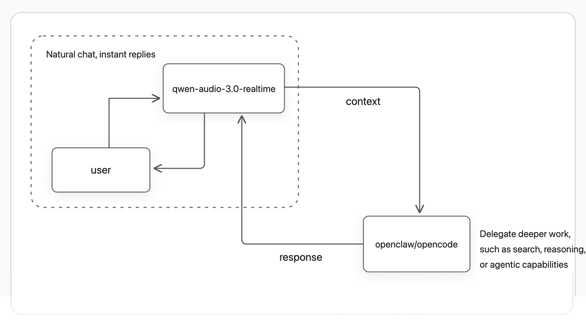

# qwen-audio-agent

[中文](README.md) | [English](README_EN.md)

## Give Your Agent a Voice

**Talk freely without waiting for tasks, and connect seamlessly to the Agent you
already use.**

qwen-audio-agent is a realtime voice frontend for mainstream Agents. Talk as
naturally as you would on a phone call, interrupt at any time, and use your
voice to delegate long-running work such as search, file operations, and coding.
Backend work never blocks the conversation; when it finishes, the result
returns naturally to the current context.

## Core Features

- Connect to the Agents you prefer: one voice entry point for different Agents,
  with support continuing to expand
- Full-duplex realtime voice, natural interruption, and continuous multi-turn
  conversation
- Voice conversation and backend tasks run in parallel, with progress queries
  and cancellation available at any time
- Task results return automatically to the current context for follow-up and
  revision
- Reuse the backend Agent's existing models, tools, MCP servers, Skills,
  permissions, and projects
- WebUI, terminal TUI, and a macOS desktop orb
- Local user profile and personal memory across sessions

## Keep Talking While Work Continues



Questions that can be answered directly receive an immediate response. Work
that needs tools or sustained processing is delegated to a backend Agent.
Throughout the entire interaction, you are always talking to the same
assistant.

<details>
<summary>View the detailed architecture</summary>


</details>

## Agent Support

| Backend Agent | Status | Main capabilities | Rating |
| --- | --- | --- | --- |
| OpenCode CLI | Supported | Tools and coding tasks, project Sessions, progress queries, and cancellation | ★★★★★ |
| OpenClaw | Supported | Agents, tools, task execution, and permission control | ★★★★☆ |
| Qoder CLI | Supported | Native CLI Sessions, starting or continuing projects, task delegation, and cancellation | ★★★★★ |
| Codex | In development | Coding tasks, tool calls, and project collaboration | ★★★★☆ |
| Hermes | In development | Tool calls, task execution, and project collaboration | ★★★★☆ |

“In development” means an independent feature branch exists but has not yet
been merged into a release. Ratings reflect coordination-tool support:
integrations with coordination tools receive five stars, while those without
them receive four. A rating does not indicate current availability. See the
[configuration guide](docs/configuration.md) for detailed setup and capability
boundaries.

## Installation

You need Node.js 22.22.2, 24.15.0, or a newer compatible version, npm 10+, and a
DashScope API Key. The repository includes `.nvmrc` and `.node-version`; if you
use nvm, run `nvm use`.

Install a published version from the npm registry:

```bash
npm install -g qwen-audio-agent
```

Install from source:

```bash
git clone https://github.com/QwenAudio/qwen-audio-agent.git
cd qwen-audio-agent
npm install
npm run install:global
```

Upgrade to the latest published version:

```bash
npm install -g qwen-audio-agent@latest
```

## Quick Start

1. Create your configuration:

```bash
qwenaudio config
```

2. Open the displayed `config.env` file and add your DashScope API Key:

```dotenv
DASHSCOPE_API_KEY=your-key
```

3. Start the service:

```bash
qwenaudio
```

4. Open another terminal and choose a voice interface:

```bash
qwenaudio tui     # Terminal interface
qwenaudio webui   # Browser interface
```

### TUI Notes

| Platform | Default mode | How to interrupt |
| --- | --- | --- |
| macOS | Full duplex with echo cancellation | Start speaking |
| Linux / Windows | Half duplex | Press `x` during playback |

Before first use on Linux or Windows, install `sounddevice` and ensure system
PortAudio is available. You can also enable full-duplex mode without echo
cancellation. Wear headphones in this mode to avoid speaker output causing
false transcription:

```bash
qwenaudio tui --audio-mode full
```

## macOS Desktop App

The desktop app provides a persistent voice orb. Start the Gateway before using
it and grant microphone permission on first launch. The settings page lets you
switch the Gateway address and orb appearance, and shows the active model and
backend Agent.

The desktop app includes a streaming wave orb and a liquid gradient orb. Their
original animated thinking / breathing states are shown below:

| Streaming Wave Orb | Liquid Gradient Orb |
| --- | --- |
|  |  |

Download the `.dmg` from the releases page, open it, and drag
**Qwen Audio Agent** into Applications.

Build a local test package from source:

```bash
npm run desktop:build:local
```

## Run the Gateway in the Background

To keep your personal assistant available, install the Gateway as a user
service:

```bash
qwenaudio gateway install
```

Common management commands:

```bash
qwenaudio gateway status
qwenaudio gateway restart
qwenaudio gateway stop
qwenaudio gateway start
qwenaudio gateway uninstall
```

## Choose a Backend Agent

Select the backend Agent with `AGENT_PROTOCOL`. OpenCode CLI is the default:

```dotenv
AGENT_PROTOCOL=opencode
```

Use OpenClaw:

```dotenv
AGENT_PROTOCOL=openclaw
```

Use Qoder CLI:

```dotenv
AGENT_PROTOCOL=qoder
QODER_MODEL=auto
```

The OpenCode integration uses the CLI and does not directly control OpenCode
Desktop. The CLI and Desktop may show the same Sessions when they share user
data. The Qoder integration uses native CLI Sessions and cannot currently
resume Qoder Desktop Quests. OpenCode and OpenClaw can also connect to an
already-running service.

Backend permissions default to `native`, so the backend Agent asks when
permission is required. Enable the following option only in trusted projects
and only if you explicitly accept automatic command execution and file
changes:

```dotenv
QWEN_AUDIO_AGENT_BACKEND_PERMISSION_MODE=full
```

See the [configuration guide](docs/configuration.md) for all options.

## User Profile and Memory

User data is stored in `~/.config/qwaudio/`:

- `USER.md`: your preferred name, location, preferences, and frequently used
  projects
- `frontend-memory.json`: information you explicitly ask the assistant to
  remember long term
- `tasks.json`: task results and pending notification state

These files remain on your computer and are never written to the source
repository. You can edit `USER.md` directly or ask the assistant to remember or
forget information during a conversation.

## Usage Notes

- Do not store passwords, API Keys, verification codes, or access tokens in
  your user profile or conversations.
- Microphone audio and realtime conversations are sent to the configured Qwen
  Audio Realtime service.
- Backend tasks may call models, tools, MCP servers, and external services
  configured for the selected Agent.
- `full` permission allows command execution and file changes. Use it only in
  trusted projects.
- The Gateway is local-only by default. Do not expose it directly to a LAN or
  the public internet.
- Wear headphones when using full duplex without echo cancellation on Linux or
  Windows.

See the [privacy notice](PRIVACY.md) for data boundaries and the
[configuration guide](docs/configuration.md) for network and permission
settings.

## Development

```bash
npm install
npm run build
npm test
```

```bash
npm run dev       # Gateway and WebUI with hot reload
npm run desktop   # macOS desktop orb
```

See [CONTRIBUTING.md](CONTRIBUTING.md) for more about building, testing, and
releasing.

## Contributing and Security

- Development and contribution guide: [CONTRIBUTING.md](CONTRIBUTING.md)
- Security reports: [SECURITY.md](SECURITY.md)
- Data flow and privacy: [PRIVACY.md](PRIVACY.md)
- Third-party notices: [THIRD_PARTY_NOTICES.md](THIRD_PARTY_NOTICES.md)

## License

[Apache License 2.0](LICENSE)
