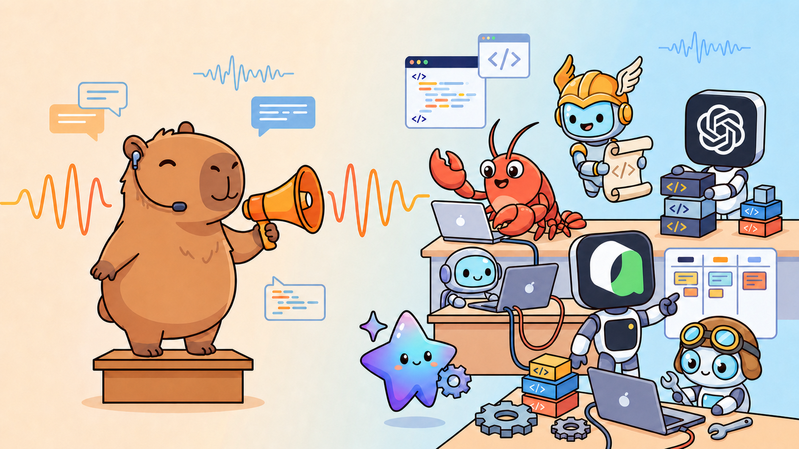

# qwen-audio-agent

[中文](README.md) | [English](README_EN.md)

[](https://github.com/QwenAudio/qwen-audio-agent/actions/workflows/ci.yml)
[](https://www.npmjs.com/package/qwen-audio-agent)
[](https://nodejs.org/)
[](LICENSE)

## Give Your Agent a Voice

**Talk freely without waiting for tasks, and connect seamlessly to the Agent you
already use.**

qwen-audio-agent is a realtime voice frontend for mainstream Agents. Talk as
naturally as you would on a phone call, interrupt at any time, and use your
voice to delegate long-running work such as search, file operations, and coding.
Backend work never blocks the conversation; when a task
finishes, the result is announced naturally.



## Core Features

- Full-duplex realtime voice interaction, natural interruption, and continuous
  multi-turn conversation
- One-click connection to the Agents you prefer, reusing their existing
  models, tools, MCP servers, and Skills
- Voice conversation and backend tasks run in parallel, with progress queries
  and cancellation available at any time
- Task results return automatically to the current context for follow-up and
  revision
- WebUI, terminal TUI, and a macOS desktop orb
- Local user profile and personal memory across sessions

## Keep Talking While Work Continues


Questions that can be answered directly receive an immediate response. Work
that needs tools or sustained processing is delegated to a backend Agent.
Throughout the entire interaction, you are always talking to the same
assistant.

<details>
<summary>View the detailed architecture</summary>


See the [architecture document](docs/architecture.md) for the full design and
module walkthrough.

</details>

## Agent Support

| Backend Agent | Status | Main capabilities | Rating |
| --- | --- | --- | --- |
| OpenCode | Supported | Tools and coding tasks, project Sessions, progress queries, and cancellation | ★★★★★ |
| OpenClaw | Supported | Agents, tools, task execution, and permission control | ★★★★★ |
| Qoder | Supported | Native CLI Sessions, starting or continuing projects, task delegation, and cancellation | ★★★★★ |
| Hermes | Supported | Native ACP, tool calls, project Sessions, and task execution | ★★★★☆ |
| CodeBuddy | Supported | Native ACP, custom models, project Sessions, and permission control | ★★★★☆ |
| Codex | Supported | Codex ACP, coding tasks, project Sessions, and permission control | ★★★★☆ |

Ratings reflect the current integration completeness, compatibility, and
extent of real-world validation. Five stars identify recommended integrations
that have been thoroughly tested; four stars identify integrations still in
development or not yet validated to the same extent. Refer to the status column
for current availability. See the [configuration guide](docs/configuration.md)
for detailed setup and capability boundaries.

## Installation

You need Node.js 22.22.2+ or 24.15.0+, npm 10+, and a
DashScope API Key. The repository includes `.nvmrc` and `.node-version`; if you
use nvm, run `nvm use`.

One-line install (directly from GitHub):

```bash
npm install -g git+https://github.com/QwenAudio/qwen-audio-agent.git
```

Install from source:

```bash
git clone https://github.com/QwenAudio/qwen-audio-agent.git
cd qwen-audio-agent
npm install
npm run install:global
```

Upgrade to the latest version (just re-run the install command):

```bash
npm install -g git+https://github.com/QwenAudio/qwen-audio-agent.git
```

## Quick Start

1. Create your configuration:

```bash
qwenaudio config
```

2. Open the displayed `config.env` file, add your DashScope API Key, and select
   OpenClaw:

```dotenv
DASHSCOPE_API_KEY=your-key
AGENT_PROTOCOL=openclaw
```

3. Start the Gateway in one terminal:

```bash
qwenaudio
```

4. Open another terminal and start the TUI:

```bash
qwenaudio tui
```

You can use the browser interface instead:

```bash
qwenaudio webui
```

### TUI Notes

| Platform | Default mode | How to interrupt |
| --- | --- | --- |
| macOS | Full duplex with echo cancellation | Start speaking |
| Linux / Windows | Half duplex | Press `x` during playback |

Before first use on Linux or Windows, install `sounddevice` and ensure system
PortAudio is available. You can also enable full-duplex mode without echo
cancellation. Wear headphones in this mode to avoid speaker output causing
false transcription:

```bash
qwenaudio tui --audio-mode full
```

## macOS Desktop App

The desktop app provides a persistent voice orb. Start the Gateway before using
it and grant microphone permission on first launch. The settings page lets you
switch the Gateway address and orb appearance, and shows the active model and
backend Agent.

The desktop app includes a streaming wave orb and a liquid gradient orb. Their
original animated thinking / breathing states are shown below:

| Streaming Wave Orb | Liquid Gradient Orb |
| --- | --- |
|  |  |

Download the `.dmg` from the releases page, open it, and drag
**Qwen Audio Agent** into Applications.

Build a local test package from source:

```bash
npm run desktop:build:local
```

## Run the Gateway in the Background

To keep your personal assistant available, install the Gateway as a user
service:

```bash
qwenaudio gateway install
```

Common management commands:

```bash
qwenaudio gateway status
qwenaudio gateway restart
qwenaudio gateway stop
qwenaudio gateway start
qwenaudio gateway uninstall
```

## Choose a Backend Agent

Select the backend Agent with `AGENT_PROTOCOL` (required, no default value).
Use OpenClaw:

```dotenv
AGENT_PROTOCOL=openclaw
```

Use OpenCode:

```dotenv
AGENT_PROTOCOL=opencode
```

Use Qoder:

```dotenv
AGENT_PROTOCOL=qoder
QODER_MODEL=auto
```

Hermes, CodeBuddy, and Codex can also be selected directly:

```dotenv
AGENT_PROTOCOL=hermes
# Or codebuddy or codex
```

Use another Agent that supports ACP over stdio:

```dotenv
AGENT_PROTOCOL=acp
ACP_COMMAND=your-agent
ACP_ARGS=["--acp"]
```

The generic ACP entry point requires no Gateway code changes. Configure its command, arguments, display label, model, and workspace with `ACP_COMMAND`, `ACP_ARGS`, `ACP_LABEL`, `ACP_MODEL`, and `ACP_WORKSPACE`.

Backend permissions default to `native`, so the backend Agent asks when
permission is required. Enable the following option only in trusted projects
and only if you explicitly accept automatic command execution and file
changes:

```dotenv
QWEN_AUDIO_AGENT_BACKEND_PERMISSION_MODE=full
```

See the [configuration guide](docs/configuration.md) for all options.

## User Profile and Memory

User data is stored in `~/.config/qwaudio/`:

- `USER.md`: your preferred name, location, preferences, and frequently used
  projects
- `frontend-memory.json`: information you explicitly ask the assistant to
  remember long term
- `tasks.json`: task results and pending notification state

These files remain on your computer and are never written to the source
repository. You can edit `USER.md` directly or ask the assistant to remember or
forget information during a conversation.

## Usage Notes

- Do not store passwords, API Keys, verification codes, or access tokens in
  your user profile or conversations.
- Microphone audio and realtime conversations are sent to the configured Qwen
  Audio Realtime service.
- Backend tasks may call models, tools, MCP servers, and external services
  configured for the selected Agent.
- `full` permission allows command execution and file changes. Use it only in
  trusted projects.
- The Gateway is local-only by default. Do not expose it directly to a LAN or
  the public internet.
- Wear headphones when using full duplex without echo cancellation on Linux or
  Windows.

See the [privacy notice](PRIVACY.md) for data boundaries and the
[configuration guide](docs/configuration.md) for network and permission
settings.

## Development

```bash
npm install
npm run build
npm test
```

```bash
npm run dev       # Gateway and WebUI with hot reload
npm run desktop   # macOS desktop orb
```

See [CONTRIBUTING.md](CONTRIBUTING.md) for more about building, testing, and
releasing.

## Contributing and Security

- Development and contribution guide: [CONTRIBUTING.md](CONTRIBUTING.md)
- Security reports: [SECURITY.md](SECURITY.md)
- Data flow and privacy: [PRIVACY.md](PRIVACY.md)
- Third-party notices: [THIRD_PARTY_NOTICES.md](THIRD_PARTY_NOTICES.md)

## License

[Apache License 2.0](LICENSE)
