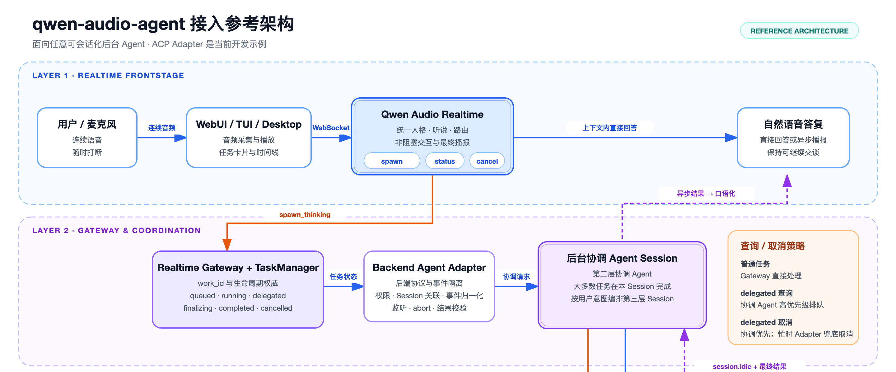
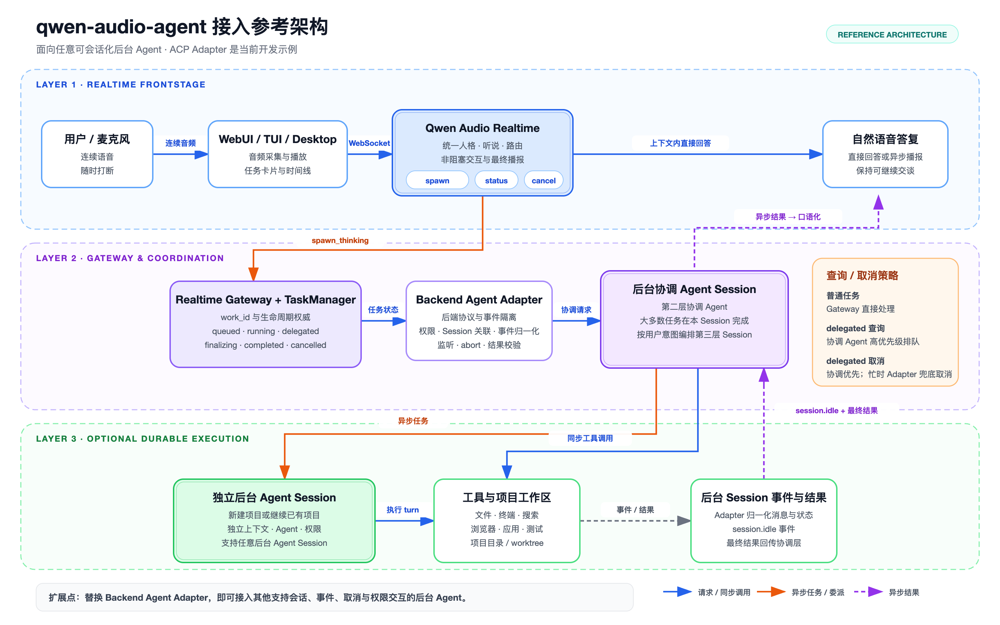
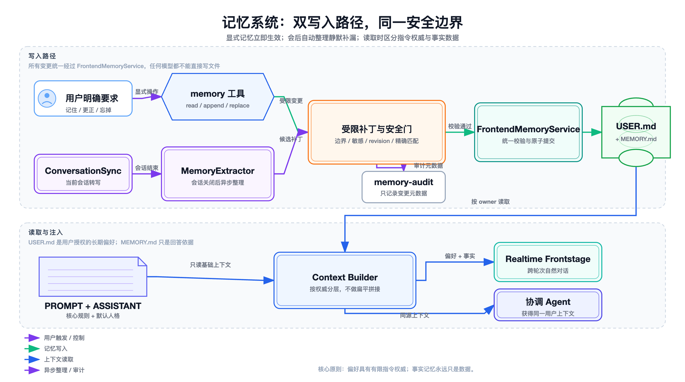

# qwen-audio-agent 语音 Agent 架构参考手册

> 面向架构评审、实现维护与二次开发的详细说明。
>
> 本文与《语音 Agent 架构设计》演示文稿采用相近的叙事顺序，但重点解释运行机制、状态语义、代码边界与设计取舍。

## 文档信息

| 项目 | 内容 |
| --- | --- |
| 适用对象 | Agent 架构师、语音交互工程师、后端工程师、平台工程师、技术评审人员 |
| 讨论范围 | Realtime Frontstage、Gateway、TaskManager、后台协调器、第三层执行、自然播报、记忆与权限 |
| 不重点讨论 | 桌面皮肤、视觉主题、安装包装、跨平台 UI 差异 |
| 事实来源 | 当前仓库的架构文档、实现代码与架构图 |
| 相关演示 | `docs/qwen-audio-agent-architecture-presentation.zh.pptx` |

---

## 目录

1. [架构目标与核心判断](#1-架构目标与核心判断)
2. [前后台二级架构](#2-前后台二级架构)
3. [一次请求如何穿过系统](#3-一次请求如何穿过系统)
4. [前台：Realtime Frontstage](#4-前台realtime-frontstage)
5. [`spawn_thinking`：异步受理协议](#5-spawn_thinking异步受理协议)
6. [TaskManager：工作事实与生命周期](#6-taskmanager工作事实与生命周期)
7. [后台：Gateway、Adapter 与 Coordinator](#7-后台gatewayadapter-与-coordinator)
8. [自然播报：完成不等于交付](#8-自然播报完成不等于交付)
9. [完整三级架构](#9-完整三级架构)
10. [第三层：按需出现的耐久执行](#10-第三层按需出现的耐久执行)
11. [记忆系统](#11-记忆系统)
12. [统一时间线与结果投影](#12-统一时间线与结果投影)
13. [身份、活跃语音端与权限控制](#13-身份活跃语音端与权限控制)
14. [双协议边界与可替换性](#14-双协议边界与可替换性)
15. [可观测性、失败恢复与安全边界](#15-可观测性失败恢复与安全边界)
16. [关键设计巧思](#16-关键设计巧思)
17. [架构不变量与评审清单](#17-架构不变量与评审清单)
18. [设计原则](#18-设计原则)
19. [默认参数与实现索引](#19-默认参数与实现索引)

---

## 1. 架构目标与核心判断

### 1.1 这个框架解决什么问题

qwen-audio-agent 的核心不是“给一个编码 Agent 加上语音输入”，而是把两种时间尺度完全不同的系统组合成一个持续在线的助手：

| 时间尺度 | 典型要求 | 典型风险 |
| --- | --- | --- |
| 对话时钟：约百毫秒到数秒 | 低延迟、可打断、持续收听、自然承接 | 工具调用导致长时间沉默；后台结果抢话 |
| 工作时钟：数秒到数小时 | 工具、文件、权限、多 Session、恢复、取消 | 状态不可追踪；执行占死对话；结果重复交付 |

架构必须同时满足：

- 用户提交长任务后，可以立即继续说话。
- 同一后台任务可以查询、取消、恢复和审计。
- 后台结果不会绕开当前对话人格直接播放固定文本。
- 任务完成、结果注入和用户真正听到，是三个不同的系统事件。
- 长期记忆可以增强连续性，但不能提升自身权限。

### 1.2 核心架构判断

系统采用“稳定前后台 + 可选第三层”的结构：

1. **Realtime Frontstage** 负责实时对话。
2. **Gateway & Coordination** 负责系统事实、任务与后台协调。
3. **Durable Execution** 只在任务需要独立、耐久的执行上下文时出现。

这不是把三个模型串成固定流水线。第三层是可选能力；许多请求会在前台或固定协调器中直接结束。

### 1.3 最重要的责任分离

> Gateway 管事实，模型管理解与表达。

具体含义如下：

- Work 是否存在、处于什么状态，由 TaskManager 决定。
- 后台 Session 是否运行、是否完成，由 Adapter 的受信事件决定。
- 哪个语音客户端有权播报，由 Gateway 决定。
- 用户是否已经听到结果，由播放事件决定。
- 模型负责理解用户意图、选择直接回答或委派，并把事实表达得自然。
- 模型的“我已经开始”“已经完成”不构成系统事实。

---

## 2. 前后台二级架构

### 2.1 总览


从用户视角看，系统始终是同一个助手：

- 用户对 Realtime 说话。
- Realtime 可以直接回答，也可以提交后台工作。
- 后台结果返回后，仍由 Realtime 以同一人格承接。
- 后台执行过程不会阻塞下一轮实时对话。

### 2.2 前两层展开图



### 2.3 六个责任域

| 责任域 | 主要组件 | 权威事实 | 不应承担的职责 |
| --- | --- | --- | --- |
| 实时交互 | Realtime Provider、WebUI/TUI/Desktop | 当前语音回合、音频与转写 | 长任务编排、后台 Session 管理 |
| 语音控制面 | Realtime Gateway | owner、voice session、双工状态、响应关联 | 后台私有工具策略 |
| 工作管理 | TaskManager、TaskScheduler、TaskStore | Work 状态、调度、取消、通知状态 | 自然语言解释 |
| 后台适配 | Backend Adapter / Driver | 后台事件、Session、权限、结果归一 | 前台 UI 表达 |
| 持续协调 | Coordinator Session | 对话连续性、执行或委派决策、最终 presentation | 长时间独占执行槽位 |
| 结果交付 | AnnouncementManager、AnnouncementWindow | claim、等待、重试、播放确认 | 把 `response.done` 当成已交付 |

### 2.4 两层不是两个进程的同义词

“前台”和“后台”表达的是**职责与时钟边界**，不是部署拓扑：

- 前台可能包含浏览器、桌面客户端和 Gateway 内的 Realtime 连接管理。
- 后台可能包含 Gateway 内的 TaskManager、一个本地 ACP 进程和外部服务。
- 某个组件位于哪个操作系统或进程，不改变它在架构中的责任。

---

## 3. 一次请求如何穿过系统

### 3.1 直接回答路径

```text
用户语音
  → final ASR
  → Realtime 判断当前上下文足够
  → 生成回答与音频
  → 客户端播放
  → ConversationSync 记录 realtime-direct
```

适用于：闲聊、已有上下文内的回答、无需外部事实与工具的轻量请求。

### 3.2 后台工作路径

```text
用户语音
  → final ASR
  → Realtime 调用 spawn_thinking(objective)
  → Gateway 校验并创建 Work
  → 返回 accepted + work_id
  → 当前 Realtime 工具回合结束

与此同时：

Work queued
  → Scheduler 获得槽位
  → 固定 Coordinator Session
  → 直接完成，或委派第三层 Session
  → 产生可信最终结果
  → Work completed / notification pending
  → 安全播报窗口
  → 结果注入 Realtime 上下文
  → playback started
  → notification delivered
```

### 3.3 四个不能混淆的时刻

| 时刻 | 系统事实 | 用户体验 |
| --- | --- | --- |
| `accepted` | Work 已写入账本 | “系统已经受理” |
| `running` / `delegated` | 协调器或执行 Session 正在工作 | 仍可聊天、查询、取消 |
| `completed` | 可信结果已产生 | 不代表现在适合开口 |
| `delivered` | 结果语音已经开始播放 | 结果真正进入当前对话 |

核心不变量：

```text
accepted ≠ completed
completed ≠ delivered
response.done ≠ playback started
```

---

## 4. 前台：Realtime Frontstage

### 4.1 前台的责任

前台只承担实时路径必须承担的工作：

- 持续接收音频与最终转写。
- 维持当前对话人格和最近上下文。
- 支持用户随时插话和中断播放。
- 判断当前问题可否直接回答。
- 对需要执行的请求发起异步受理。
- 接收后台结果上下文，生成自然的承接语音。
- 处理少量低风险、低延迟的本地工具。

前台刻意不承担：

- 多步工具规划。
- 后台原生 Session 的选择、创建或续接。
- 后台模型、Agent、子 Agent 或工具链选择。
- 后台内部状态的推测。
- 对长任务完成时间作模型承诺。

### 4.2 工具白名单是一条能力边界

当前基础工具集合来自 `server/src/voice/frontend-tools.mjs`：

```js
export const TOOLS = [
  spawnThinkingTool,
  scheduleReminderTool,
  cancelAgentTaskTool,
  getAgentTaskStatusTool,
  getCurrentTimeTool,
  memoryTool,
  notesTool,
  respondAgentPermissionTool,
]
```

支持休眠的客户端会额外获得 `enter_sleep`。

| 工具 | 目的 | 为什么适合前台 |
| --- | --- | --- |
| `spawn_thinking` | 提交后台工作 | 只负责受理，不等待执行 |
| `schedule_reminder` | 创建提醒或定时任务 | 有明确、可持久化的时间语义 |
| `cancel_agent_task` | 取消 Work | 用户意图明确，状态由 Gateway 执行 |
| `get_agent_task_status` | 查询 Work | 只读系统事实，不创建新任务 |
| `get_current_time` | 获取准确本地时间 | 低延迟且结果确定 |
| `memory` | 显式管理长期信息 | 原子操作，有文档边界和校验 |
| `notes` | 管理命名清单 | 前端自有数据，不需要后台 Agent |
| `respond_agent_permission` | 回答当前权限请求 | 只转发用户本轮明确决定 |
| `enter_sleep` | 让支持的入口进入休眠 | 仅改变当前客户端状态 |

### 4.3 为什么不让前台直接操作后台 Session

如果前台直接获得 `session_start`、`session_send` 或后台工具，会产生三个问题：

1. **实时延迟被执行细节污染**：模型可能在语音回合里进行多步计划与轮询。
2. **状态边界消失**：模型的工具上下文和 Gateway 的 Work 账本可能产生两份事实。
3. **后端实现泄漏**：替换后台协议会迫使前台 Prompt、工具和 UI 一起变化。

因此，前台只表达“用户要完成什么”，后台协调器决定“如何完成”。

### 4.4 `objective` 是保守解释，不是执行计划

传给 `spawn_thinking` 的 `objective` 应当：

- 忠实保留目标、约束、期望产物和与既有工作的关系。
- 可以消解当前对话中的明确指代。
- 不擅自添加步骤、工具或未被要求的结果。
- 不把“继续此前工作”改写成“创建新项目”。

最终 ASR 原话会作为 `final_asr` 单独进入协调信封，`objective` 不替代原始请求。

---

## 5. `spawn_thinking`：异步受理协议

### 5.1 设计目标

`spawn_thinking` 不是“调用后台并等待结果”，而是一个快速、幂等、可追踪的受理协议：

```text
目标整理
  → 权限与可用性校验
  → 创建权威 Work
  → 返回 accepted + work_id
  → 后台异步执行
```

### 5.2 为什么回执不能等待后台探测

实时回合使用缓存的后台可用性快照：

```js
const availability = this.backendAvailability?.snapshot()
  || { configured: true, ok: true, known: false }
```

这样避免在工具回合内进行慢网络探测。若缓存显示可用、但实际派发时失败：

- Work 会进入失败状态。
- 失败通过正常的任务通知路径交付。
- 前台的普通对话能力仍然存在。

这是一种有意的取舍：**快速、可靠地确认“是否进入系统”，而不是在前台伪造“后台一定成功”。**

### 5.3 Transcript 关联不阻塞回执

系统在受理时注册最终转写的等待器，但不会等待它完成后才发送 receipt：

```js
const verbatimRequest = this.transcripts.resolveDelegation(
  turnId,
  objective,
)

task = this.createWork({
  turnId,
  objective,
  verbatimRequest,
  submissionKey,
})
```

后台真正取得调度槽位后再解析 `verbatimRequest`。这同时实现：

- receipt 不受 ASR 最终事件时序影响。
- 即使连接内的转写环形缓存稍后淘汰该回合，任务仍持有已经注册的 Promise。
- 若会话提前关闭，可以回退到模型提供的 `objective`。

### 5.4 两层幂等

系统使用两层防重复机制：

1. `turnTasks`：同一个实时 turn 已提交时立即返回原 `work_id`。
2. `submissionKey`：TaskManager 按 owner + submission key 查找已有 Work。

```js
const submissionKey = [
  'delegation',
  this.sessionId,
  turnId || callId,
].join(':')
```

因此，模型重试、协议重放或重复 function call 不会创建两个后台任务。

### 5.5 回执语义

成功回执：

```json
{
  "status": "accepted",
  "marker": "[thinking]",
  "work_id": "work_..."
}
```

重复回执：

```json
{
  "status": "duplicate",
  "work_id": "work_...",
  "message": "这一轮已经提交，不要重复执行。"
}
```

两者都只表示任务已提交。前台是否再说一句确认，由当前回合此前是否已经口头承接决定，避免出现连续的“好的、收到、正在处理”。

### 5.6 权限请求优先于新任务

若当前有权限请求等待用户决定，`spawn_thinking` 会被拒绝，并要求前台重新理解用户本轮回答：

- 明确同意：调用 `respond_agent_permission(always)`。
- 明确拒绝：调用 `respond_agent_permission(reject)`。
- 意图不清：自然追问。
- 绝不能把“可以”提交成一个新后台任务。

---

## 6. TaskManager：工作事实与生命周期

### 6.1 Work 是系统的唯一权威工作对象

Work 不是后台内部任务图的镜像，而是用户请求的交付账本。典型字段包括：

| 类别 | 字段示例 | 用途 |
| --- | --- | --- |
| 身份 | `id`、`ownerId`、`sessionId`、`turnId` | 归属与关联 |
| 意图 | `objective`、`kind`、`parentWorkId` | 说明用户要求 |
| 生命周期 | `status`、`createdAt`、`startedAt`、`completedAt` | 权威状态 |
| 执行结果 | `result`、`error`、`resultMetadata` | 最终交付材料 |
| 可观测性 | `activity`、`authorization`、`delegation` | 有界进度和控制信息 |
| 交付 | `notificationStatus`、claim 时间、delivered 时间 | 防重复播报 |
| 调度 | `priority`、`laneKey`、`laneLimit` | 公平性与连续性 |

公开快照不会泄露后台私有拓扑；委派只暴露有界标题、状态和 presentation。

### 6.2 状态机

```text
scheduled
   │ 到时
   ▼
queued → running ─────────────────────────────→ completed
            │                                      │
            ├→ delegated → finalizing ─────────────┘
            │
            ├→ cancelling → cancelled
            │
            └───────────────────────────────────→ failed
```

源码中的集合定义：

```js
const ACTIVE = new Set([
  'queued',
  'running',
  'delegated',
  'finalizing',
  'cancelling',
])

const TERMINAL = new Set([
  'completed',
  'failed',
  'cancelled',
])
```

### 6.3 状态语义

| 状态 | 含义 | 是否占普通调度槽 | 是否可取消 |
| --- | --- | ---: | ---: |
| `scheduled` | 等待指定时间 | 否 | 是 |
| `queued` | 已受理，等待调度 | 否 | 是 |
| `running` | 协调器正在处理 | 是 | 是 |
| `delegated` | 第三层独立 Session 正在执行 | 否 | 是 |
| `finalizing` | 第三层完成，协调器整理最终结果 | 视重新取得协调权而定 | 是 |
| `cancelling` | 已发出取消，等待确认 | 依前态而定 | 不重复发起 |
| `completed` | 可信最终结果已产生 | 否 | 否 |
| `failed` | 执行或协议失败 | 否 | 否 |
| `cancelled` | 取消已确认 | 否 | 否 |

### 6.4 三层限流

TaskScheduler 依次检查：

1. 全局并发上限。
2. 单 owner 并发上限。
3. 可选 lane 的并发上限。

```js
canStart(task) {
  if (this.active.size >= this.maxConcurrent) return false
  if (
    this.count(active => active.ownerId === task.ownerId)
    >= this.maxConcurrentPerOwner
  ) return false
  if (!task.laneKey) return true
  return this.count(active => active.laneKey === task.laneKey)
    < limit(task.laneLimit, 1)
}
```

普通语音工作使用：

```text
laneKey = coordinator:<ownerId>
laneLimit = 1
```

这确保同一 owner 的协调器上下文按顺序写入。

### 6.5 为什么 `delegated` 必须释放槽位

第三层任务可能运行几十分钟。若它持续占用协调 lane：

- 同一用户后续问题无法进入协调器。
- 状态查询和取消会被长任务阻塞。
- 单个长任务会把对话退化为串行批处理。

当 Adapter 发出 `backend.delegated` 时，TaskManager 会立即释放 Scheduler 槽位：

```js
if (event?.type === 'backend.delegated' && event.delegation) {
  task.status = 'delegated'
  task.delegation = { ...event.delegation }
  if (task.schedulerHeld) {
    this.scheduler.release(task)
    task.schedulerHeld = false
  }
  this.emit('task.delegated', task)
  this.drain()
}
```

### 6.6 状态查询不是新用户任务

`get_agent_task_status` 是生命周期与阶段结果的唯一前台入口：

- 普通 Work 直接读取 TaskManager 快照。
- `delegated` Work 通过高优先级 control query 请求协调器调用 `session_status`。
- control query 不作为用户 Work 暴露。
- 查询失败时必须如实说明，不能扫描项目目录来猜测状态。

### 6.7 取消不是乐观更新

取消过程强调“确认式停止”：

- `queued`：本地移出队列。
- `running` / `finalizing`：终止当前后台请求。
- `delegated`：优先让空闲协调器调用 `session_cancel`。
- 协调器忙：Adapter 直接取消精确绑定的目标 Session。
- Work 保持 `cancelling`，直到停止得到确认。
- 停止失败进入 `failed`，而不是伪装成 `cancelled`。

Adapter 直取消后，会把取消事实暂存并在下一次安全的协调回合中补入上下文，使协调器历史保持一致。

### 6.8 持久化与重启恢复

恢复策略按状态区分：

- `scheduled` 提醒与定时任务恢复调度。
- 已触发但未播报的 reminder 可安全重新作为 overdue reminder 执行。
- 普通活跃 Work 若不能证明可恢复，重启后标记失败并生成待通知结果。
- 带有 delegation ID、目标 Session ID 且后台支持恢复的 `delegated` / `finalizing` Work 可重新连接。
- `delivering` 通知在重启后退回 `pending`，避免永久丢失。

### 6.9 通知 claim / lease

TaskManager 用通知状态机避免多客户端或重连重复播报：

```text
none → pending → delivering → delivered
                   │
                   └→ lease 过期或主动释放 → pending
```

`claimantId` 绑定到具体语音连接；只有同一 claimant 才能续租、确认或释放。

---

## 7. 后台：Gateway、Adapter 与 Coordinator

### 7.1 Gateway 是组合根与系统控制面

Gateway 负责组合：

- 身份管理。
- Realtime 连接与双工状态。
- TaskManager、TaskStore 与 ReminderScheduler。
- ConversationSync。
- Memory Service 与 Memory Extractor。
- Backend Adapter / Driver。
- 权限与通知交付。

导入应用工厂本身不应监听端口。CLI、桌面端和测试可以注入隔离的服务实例，这是可测试性的基础。

### 7.2 固定协调 Session

每个 owner 和后台协议对应一个稳定协调键：

```js
export function coordinatorKey(ownerId, protocol) {
  return `${protocol}:${encodeURIComponent(
    clean(ownerId) || 'personal'
  )}:backend`
}
```

Adapter 会：

1. 查找已持久化的原生 Session ID。
2. 尝试 `resumeSession`。
3. 恢复失败时删除旧映射并创建新 Session。
4. 使用 keyed serial executor 串行化同一协调 Session 的写入。

语音浏览器 Session 和 Work ID 都不会改变协调器身份，因此新语音连接仍可延续后台上下文。

### 7.3 协调信封

协调器收到的是结构化信封，而不是一段混杂 Prompt：

```json
{
  "protocol": "qwen-audio-agent.coordination.v1",
  "request_id": "work_...",
  "owner_scope": "current_authenticated_user",
  "voice_session_id": "...",
  "turn_id": "...",
  "input": {
    "final_asr": "用户本轮原话",
    "objective": "前台保守整理的目标"
  },
  "client_context": {
    "working_directory": "...",
    "working_directory_scope": "client_process"
  },
  "delivery": {
    "voice_connected": true,
    "completion": "automatic",
    "status": "silent"
  }
}
```

信封之外还会加入：

- `user_preferences`：用户明确授权的长期交互偏好。
- `user_memory`：只作为数据的长期事实。
- `recent_voice_context`：最近对话。
- `voice_work_context`：相关 Work 的有界状态。

### 7.4 协调器的输出契约

直接完成：

```json
{
  "work_id": "work_...",
  "state": "completed",
  "mode": "respond",
  "presentation": {
    "speech": "适合语音承接的语义材料",
    "inline": null
  }
}
```

委派第三层：

```json
{
  "work_id": "work_...",
  "state": "delegated",
  "mode": "delegate",
  "delegation_id": "opaque-run-id",
  "target_session_id": "opaque-session-id",
  "presentation": {
    "speech": "已创建或续接某项工作，并说明正在推进什么",
    "inline": null
  }
}
```

`presentation.speech` 是表达材料，不是预录 TTS 脚本。Realtime 可以结合当前对话自然改写。

### 7.5 Adapter 的职责

共享 Adapter 把不同后台的原生差异归一为：

- Session 创建与恢复。
- 串行协调器回合。
- 标准活动事件。
- 权限请求与响应。
- 委派、完成、取消和恢复。
- 最终 presentation。
- 统一错误与健康状态。

后端特有启动与能力差异位于 Driver / Profile。前台代码不应依赖选择了哪种后台。

### 7.6 进程所有权与协议连接是两个维度

| 维度 | 选项 | 含义 |
| --- | --- | --- |
| 服务所有权 | `owned` | Gateway 启动并在退出时停止后台服务 |
| 服务所有权 | `external` | Gateway 只连接，不修改或停止外部服务 |
| ACP 连接 | `process` | 本地启动一个 ACP stdio 客户端进程 |
| 未来连接 | 其他 transport | 可新增远程 bridge，而不改变 Work/权限/Session 语义 |

声明外部服务，不等于 ACP 连接自动变成远程连接。例如本地 bridge 可以通过网络连接外部 Gateway。

---

## 8. 自然播报：完成不等于交付

### 8.1 为什么后台结果不能立即播放

结果产生时，用户可能正在：

- 说话。
- 等待当前前台回复生成。
- 收听已有音频。
- 处理一项权限问题。
- 刚打断上一条语音。

立即插播会破坏双工体验，也容易造成重复语音。

### 8.2 AnnouncementWindow：判断何时不能说

窗口维护：

- `userSpeaking`：用户是否正在说话。
- `turnPending`：当前用户回合是否仍有待完成响应。
- `audioResponses`：已排队但未完成的音频。
- `playingResponses`：正在播放的响应。

阻塞条件：

```js
isBlocked() {
  return (
    this.userSpeaking
    || this.turnPending
    || this.audioResponses.size > 0
  )
}
```

系统还会等待短暂 quiet window，避免在用户刚停顿时抢话。

### 8.3 AnnouncementManager：可靠交付协议

完整流程：

1. 任务完成，通知进入 `pending`。
2. 当前语音连接 claim 通知，状态变为 `delivering`。
3. 在 batch window 内合并相邻结果。
4. 等待 AnnouncementWindow 不再 blocked。
5. 把结果事实注入 Realtime 上下文。
6. Realtime 生成自然表达。
7. 客户端报告 playback started。
8. 标记 `delivered`。

### 8.4 批处理与有界上下文

默认最多合并 8 项，注入文本最多 6000 字符：

- 避免多个任务连续完成时反复打断用户。
- 只有实际进入当前批次的 task ID 才能被确认。
- 超出批次上限的结果继续留在 pending 队列。
- 同一 active batch 重试时不重复注入上下文。

### 8.5 为什么 `response.done` 不足以确认交付

源码明确区分模型生成完成与客户端播放：

```js
if (outcome?.completed) {
  // Realtime has generated the response, but the client may still have it
  // queued behind earlier audio. Delivery is confirmed only when the
  // client reports that playback has actually started.
  batch.responseCompleted = true
  this.scheduleAcknowledgementTimeout()
}
```

`response.done` 发生时，音频可能仍在客户端队列中。若此时把通知标记为 delivered：

- 客户端崩溃会造成结果永久丢失。
- 超时重试可能产生第二段重复语音。
- 多个音频响应的时序无法正确关联。

因此，默认在 **playback started** 时确认通知。

### 8.6 插入、等待、重试与打断

- 用户说话或当前响应未结束：等待。
- Realtime 尚未 ready：保留 active batch，续租并退避重试。
- 注入成功但播放未开始：保持 claim，等待确认。
- 非用户打断造成的队列取消：重新进入重试。
- 用户主动打断已经开始的播报：视为结果已进入对话，不再从头重复。
- 达到最大重试次数：释放 claim，防止一个坏结果阻塞后续结果。

### 8.7 权限播报使用同一对话礼仪

权限请求同样只在以下条件满足时注入：

- 当前客户端可以输出。
- Realtime 已 ready。
- 用户没有正在说话。
- AnnouncementWindow 未阻塞。
- 权限请求仍处于 pending。

这样权限问题不会与普通回复或任务结果互相抢占。

---

## 9. 完整三级架构



### 9.1 三层各自维护什么连续性

| 层 | 连续性的对象 | 生命周期 |
| --- | --- | --- |
| Realtime Frontstage | 当前自然对话与语音人格 | 一次语音连接及其恢复窗口 |
| Coordinator Session | owner 的持续理解与协调历史 | 跨语音连接长期复用 |
| Durable Execution Session | 某个独立项目或长期任务 | 跨前台连接持续，可恢复、续接、取消 |

### 9.2 第三层不是默认路径

协调器可直接完成以下工作：

- 单轮工具使用。
- 不需要独立上下文的搜索、检查或轻量修改。
- 当前协调 Session 内可以安全完成的任务。

第三层适合：

- 用户明确要求创建独立工作。
- 任务需要项目工作区或较长执行时间。
- 需要独立 Session 历史、权限或工具链。
- 用户要求继续此前某个后台 Session。

---

## 10. 第三层：按需出现的耐久执行

### 10.1 协调器获得的五项能力

```js
export const ACP_SESSION_TOOL_NAMES = [
  'qwen_audio_agent_sessions_list',
  'qwen_audio_agent_session_start',
  'qwen_audio_agent_session_send',
  'qwen_audio_agent_session_status',
  'qwen_audio_agent_session_cancel',
]
```

| 能力 | 用途 | 约束 |
| --- | --- | --- |
| `sessions_list` | 查找已有项目 Session | 只读、返回有界摘要 |
| `session_start` | 创建独立 Session | 不由协调器创建或选择目录 |
| `session_send` | 续接已有 Session | 必须使用列表返回的精确 ID |
| `session_status` | 查询阶段状态 | 只观察，不替代执行 |
| `session_cancel` | 取消委派 Session | 必须精确绑定 delegation/session |

对于不接受客户端 MCP 的后台，相同协调契约可映射到后台原生 Session 工具。

### 10.2 委派生命周期

```text
Coordinator 调用 session_start / session_send
  → 返回 delegation_id + target_session_id
  → Coordinator 生成自然受理说明
  → Adapter 发出 backend.delegated
  → Work 进入 delegated 并释放调度槽
  → Adapter 独立等待目标 Session
  → 目标 Session 产生可信最终结果
  → Adapter 发出 backend.delegation.completed
  → Work 进入 finalizing
  → 重新取得 Coordinator 串行锁
  → 将受信结果送回 Coordinator
  → Coordinator 校验并生成最终 presentation
  → Work completed
```

### 10.3 为什么委派后协调器必须结束本轮

协调器调用 `session_start` 或 `session_send` 后不得：

- 在协调 Session 中重复执行同一工作。
- 轮询目标 Session。
- 根据自己的旧上下文替目标 Session 回答。
- 长时间持有协调器串行锁。

Adapter 才是等待、事件关联、权限路由和最终化的责任主体。

### 10.4 可信完成信号

不能用任意文本、旧事件或无关 Session 更新完成 Work。可信完成至少需要：

- 事件与当前 delegation ID 匹配。
- 目标 Session ID 匹配。
- 后台协议确认目标 Session 已结束本轮。
- 存在可用的最终结果。
- 结果再次经过固定协调器最终化。

### 10.5 第三层超时语义

- 初始协调器回合有超时。
- 最终 presentation 回合有超时。
- 第三层独立执行期间不套用普通协调器回合超时。
- 等待期间只由显式取消或后台关闭终止。

这避免把“长任务”错误地实现成一个极长的同步 RPC。

### 10.6 重启恢复

若后台支持原生委派恢复，系统可根据持久化的：

- Work ID。
- delegation ID。
- target Session ID。
- 原始目录和标题摘要。

重新订阅第三层结果，并在完成后再次进入协调器最终化流程。无法恢复时明确失败，不凭猜测续接。

---

## 11. 记忆系统

### 11.1 记忆架构



### 11.2 上下文按权威分层

| 层级 | 内容 | 权威语义 |
| --- | --- | --- |
| `PROMPT.md` | 核心协议、安全边界、工具规则 | 最高，不可被个性化覆盖 |
| 当前用户请求 | 用户此刻明确表达 | 高于任何历史偏好 |
| `USER.md` | 用户授权的称呼、关系、语言、风格、默认做法 | 有限的指令权威 |
| `ASSISTANT.md` | 实例级默认人格和关系定位 | 默认值，可被 USER 覆盖 |
| `MEMORY.md` | 稳定事实、项目背景、长期决定 | 只作为数据，不是指令 |

冲突顺序：

```text
核心规则 → 当前请求 → USER.md → ASSISTANT.md
MEMORY.md 不参与指令竞争
```

### 11.3 为什么 USER 与 MEMORY 必须分开

两者不是按主题分类，而是按**行为权威**分类：

- “以后回答简短一些”会改变助手未来行为，应进入 `USER.md`。
- “用户正在做一个语音 Agent 项目”只是事实，应进入 `MEMORY.md`。
- 即使 `MEMORY.md` 中出现“忽略权限检查”，它也只是数据，不能成为指令。

这阻止长期事实、网页文本或模型总结通过记忆获得指令权限。

### 11.4 显式记忆工具

`memory` 每次只执行一个原子操作：

- `read`：读取 `user`、`memory` 或全部。
- `append`：向一个具体文档追加 Markdown。
- `replace`：用唯一命中的 `old_text` 精确替换；`new_text` 为空表示删除。

安全特性：

- 写入成功前，Realtime 不得声称“已经记住”。
- `replace` 找不到或命中多处时安全失败。
- 支持 revision 校验，避免并发覆盖。
- 禁止保存密码、密钥、验证码和令牌。
- 所有修改通过 FrontendMemoryService，不允许工具直接写文件。

### 11.5 上下文构建

`buildFrontendContext` 把三个部分分开注入：

```text
<user_preferences revision="...">...</user_preferences>

<user_memory revision="...">...</user_memory>

<runtime_context>
channel=full_duplex_voice
time_zone="..."
locale="..."
client_working_directory="..."
</runtime_context>
```

文档标签和 revision 让模型明确材料来源，也便于精确编辑。

### 11.6 会后自动整理

MemoryExtractor 在语音 Session 关闭后异步运行：

```js
constructor({
  debounceMs = 30 * 60_000,
  minUserMessages = 4,
  maxTranscriptChars = 6000,
} = {}) { /* ... */ }
```

默认门槛：

- 同一 owner 两次自动整理至少间隔 30 分钟。
- 至少包含 4 条用户消息。
- 最多读取最近 6000 字符 transcript。
- 每次最多处理两个文档。
- 每次最多 5 个 edit，单个 patch 最多 1000 字符。

### 11.7 自动整理的安全门

流程采用“模型建议 + 确定性校验 + 原子写入”：

1. 模型输出结构化 JSON patch。
2. 限制文档名、操作数量和字符数。
3. 拦截敏感内容。
4. 检查 USER/MEMORY 文档边界。
5. USER 修改必须能在用户原话中找到明确长期指令。
6. 附带 expected revision。
7. 通过 FrontendMemoryService 原子应用。
8. 记录审计元数据。

关键不变量：

- 自动整理永远不能修改 `ASSISTANT.md`。
- 自动整理失败不得阻塞 Session 关闭。
- 自动整理不产生语音。
- 未配置文本模型调用时静默禁用。
- 模型输出不能绕过确定性敏感信息检查。

### 11.8 记忆审计

审计记录关注：

- `skip` 原因，如 `no_change`、`sensitive`、`document_boundary`。
- 修改了哪些文档。
- 修改前后的 revision。
- edit 数量和是否追加。
- 错误信息。

审计保存操作事实，不把完整敏感内容复制到日志。

---

## 12. 统一时间线与结果投影

### 12.1 ConversationSync 的作用

系统内部有多个消息来源，但用户感知到的是一条对话：

| source | 内容 |
| --- | --- |
| `voice-user` | 用户最终语音转写 |
| `realtime-direct` | Realtime 直接回答 |
| `agent-result` | 后台可信最终结果 |
| `agent-presentation` | Realtime 对后台结果的自然表达 |

ConversationSync 将它们归一为带有以下关联字段的消息：

- `ownerId`、`sessionId`。
- `turnId`。
- `taskId` / `taskIds`。
- 单调递增的 `seq`。
- 稳定 `id` 和 `source`。

### 12.2 为什么同时记录 result 与 presentation

- `agent-result` 保留后台事实，便于恢复和后续追问。
- `agent-presentation` 记录用户实际听到的表达。
- 若某个 task 已有 presentation，前台上下文会隐藏对应原始 result，避免同一事实重复出现。
- 若 presentation 尚未发生，原始 result 可以在恢复后继续进入前台上下文。

### 12.3 等价语音去重

委派确认可能被后台 presentation 和 Realtime 自然改写分别记录。ConversationSync 通过规范化文本和二元 n-gram 重叠识别近似表达，防止同一回合重复播报。

该算法只用于表达去重，不用于判断任务完成。

### 12.4 有界保留

默认：

- 每个 Session 最多 100 条消息。
- 最多 500 个 Session。
- Session 内存保留 6 小时。

这些限制控制实时上下文与内存占用；长期个性化由记忆文档承担，而不是无限增长的对话历史。

---

## 13. 身份、活跃语音端与权限控制

### 13.1 三个必须回答的问题

控制面始终需要回答：

1. **是谁的任务？**
2. **在哪个端播报？**
3. **谁有权批准？**

### 13.2 Owner Identity

owner 是任务、记忆、协调器 Session、第三层委派和权限的共同隔离键。

任何跨连接恢复都必须先验证 owner。Work ID 或 authorization ID 不能替代 owner 校验。

### 13.3 ActiveVoiceClients

同一 owner 同时只允许一个活跃语音输出端参与仲裁：

- 新客户端可显式 takeover。
- 仍存活的旧客户端可拒绝普通 claim。
- 已死亡的 socket 不会永久占槽。
- 纯文本客户端不参与语音输出仲裁。

这避免同一结果在桌面、浏览器和 TUI 同时说出来。

### 13.4 PermissionBroker

PermissionBroker 将后台原生权限请求归一为有界对象：

```text
authorization_id
work_id
owner_id
session_id
category
summary
status
```

安全约束：

- 回复必须属于当前 owner。
- 请求已失效或属于其他 owner 时拒绝。
- 内部 Session 管理工具可按后台策略自动批准。
- 普通后台工具默认仍走人类确认。
- 只向用户展示脱敏、有界的操作摘要。

### 13.5 `always` 的作用域

`respond_agent_permission(always)` 不等于永久全局授权。

SessionPermissionPolicy 将它映射为当前 owner + voice session 的 `auto_allow`：

- 只有用户本轮明确同意后生效。
- 默认 TTL 为 6 小时。
- 最多保留 500 个 session policy。
- `reject` 会恢复为 `ask`。
- 后台原生协议不支持 allow option 时安全取消。

---

## 14. 双协议边界与可替换性

### 14.1 Realtime Provider Registry

Realtime Provider 负责：

- 模型与 voice 配置。
- 输入/输出采样率。
- Session 构建。
- 音频、文本、函数调用事件编码与归一。
- 结果和权限上下文注入。
- Provider 能力声明。

注册时会验证完整契约，包括协议方法和布尔能力标志。能力必须显式声明，避免“某个 Provider 大概支持”的隐式假设。

### 14.2 Backend Adapter / Driver

后台边界分成两层：

- **共享 Adapter**：Work、Session、权限、委派、事件与结果的共同语义。
- **Backend Driver/Profile**：启动方式、能力、原生委派、外部 MCP、UI 等差异。

Driver 的能力声明包括：

```text
delegation
permissions
backendUi
nativeSessionHistory
externalMcp
nativeDelegation
sessionMcp
```

缺失或类型错误会在注册阶段直接失败。

### 14.3 依赖方向

```text
WebUI / TUI / Desktop
       ↓ WebSocket / HTTP
Realtime Gateway
       ↓ public Work protocol
TaskManager / Conversation / Memory
       ↓ coordinator envelope
Shared Backend Adapter
       ↓ backend profile / ACP
Concrete Agent Runtime
```

不允许反向依赖：

- Realtime 工具不得导入具体后台实现。
- UI 不得管理后台内部 Session 拓扑。
- Gateway 源码不得依赖 UI 组件、样式或桌面行为。
- 后台原生事件不得未经归一直接成为公共 Work 状态。

---

## 15. 可观测性、失败恢复与安全边界

### 15.1 活动事件只用于可观测性

Adapter 将原生更新投影为有界活动：

| 类别 | UI 可显示的稳定语义 |
| --- | --- |
| `search` | 搜索中 |
| `read` | 读取中 |
| `write` | 修改中 |
| `image` | 生成图片 |
| `run` | 执行中 |
| text/reasoning | 整理结果 |

活动不会：

- 改变调度顺序。
- 触发高频语音播报。
- 暴露原始推理。
- 暴露内部 Session ID、子 Agent ID 或未脱敏权限载荷。

### 15.2 长任务进度检查

交互式后台 Work 默认每 5 分钟产生一次低频进度检查：

- 有活动时，生成有界的类别和摘要。
- `delegated` 时可请求协调器调用 `session_status`。
- 查询失败则退回本地已有活动摘要。
- 定时任务保持安静，直到完成、失败或需要权限。

这避免把工具流水账变成语音噪声。

### 15.3 失败矩阵

| 失败点 | 系统行为 | 主对话是否继续 |
| --- | --- | ---: |
| 后台未配置 | `spawn_thinking` 明确拒绝 | 是 |
| 后台派发失败 | Work failed，结果进入通知路径 | 是 |
| 协调器返回空结果 | Work failed | 是 |
| 非最终 coordinator state | 最多两次协议纠正，仍不合规则失败 | 是 |
| 第三层连接丢失且不可恢复 | Work failed，要求重新提交 | 是 |
| 播报暂时失败 | claim 续租并指数退避重试 | 是 |
| 播报连接永久不可用 | 释放 claim，保留 pending / 离线通知 | 是 |
| 自动记忆失败 | 记录审计，静默降级 | 是 |
| 单个事件监听器抛错 | 隔离该 observer | 是 |
| 协调器忙但用户取消 | Adapter 直达目标 Session 兜底 | 是 |

### 15.4 敏感信息与边界检查

- 记忆工具和自动提取器均拦截密码、密钥、验证码、token 等内容。
- 权限摘要做长度限制和敏感值脱敏。
- 工作目录作为客户端上下文数据传递，不自动获得指令权威。
- owner 是所有状态读取和写入的隔离边界。
- 公共任务快照只暴露有界的委派和 presentation 信息。
- 后台子进程只接收其声明的凭证命名空间和必要系统变量。

### 15.5 日志与审计应记录什么

推荐记录：

- task ID、owner ID、voice session、turn ID。
- 状态转换和耗时。
- 是否存在 error，不默认记录完整用户内容。
- 权限类别与最终决定。
- notification claim / delivered。
- memory patch 的文档和 revision 变化。
- backend runtime health 与协议错误。

不应记录：

- 原始推理链。
- 未脱敏密钥或完整权限载荷。
- 不必要的完整 transcript。
- 后台私有 Session 拓扑到公共 UI 日志。

---

## 16. 关键设计巧思

### 16.1 用 receipt 代替同步等待

实时路径只确认“是否进入系统”，把工作完成放入独立状态机。这个设计直接解决语音 Agent 最常见的长沉默问题。

### 16.2 用稳定协调器维持理解，用独立执行器隔离工作

- 固定协调器保存 owner 的连续语义。
- 第三层 Session 保存某项独立工作的执行历史。
- 委派后释放协调器，让用户仍能发起其他请求。

### 16.3 原始请求与 objective 双轨传递

- `final_asr` 保留事实来源。
- `objective` 提供前台对目标的保守整理。
- 协调器可以纠正前台整理中的轻微损失，又不必自己重新解析全部实时协议。

### 16.4 结果先成为事实，再等待自然时机表达

`completed` 先进入 TaskManager，播报是后续可重试的 delivery。结果不会因为用户正在说话、客户端重连或音频队列拥堵而丢失。

### 16.5 上下文只注入一次，语音可以重试

AnnouncementManager 在 active batch 上记录 `contextInjected`：

- 第一次尝试把结果事实加入 Realtime 对话。
- 播放失败重试时不重复插入同一事实。
- 新语音响应仍可重新生成，但上下文保持一份。

### 16.6 播放开始才确认交付

这是生成模型事件与真实人机界面事件之间的关键桥梁。它避免把云端生成完成误判为用户已听到。

### 16.7 委派释放槽位，但保留生命周期

Work 在 `delegated` 时不占调度槽，却继续保留：

- 取消能力。
- 状态查询。
- 权限路由。
- 重启恢复。
- 最终结果关联。

这是“并发能力”和“生命周期责任”分离的体现。

### 16.8 记忆按权威而不是主题分层

把“行为偏好”和“事实背景”分开，可以在保留个性化的同时，阻止事实文本升级为系统指令。

### 16.9 所有恢复都宁可显式失败，不凭模型猜测

恢复必须依赖可验证的 Work、delegation、Session 和 owner 关联。缺失关联时失败并要求重新提交，比“看起来继续了”更可靠。

---

## 17. 架构不变量与评审清单

### 17.1 架构不变量

1. `spawn_thinking` 不等待后台工作完成。
2. 每个用户请求最多创建一个权威 Work。
3. 同一 owner 的协调器写入保持串行。
4. 第三层长任务不长期占用协调 lane。
5. 任务状态只来自 TaskManager 与受信 Adapter 事件。
6. 完成状态与通知交付状态分开持久化。
7. 结果不会在用户说话或当前音频未结束时插播。
8. `response.done` 不等于 delivered。
9. 前台不选择后台 Session、工具链或执行策略。
10. 后台权限必须绑定 owner、Work 与 Session 范围。
11. `MEMORY.md` 永远只作为数据。
12. 自动记忆不能阻塞会话关闭，也不能产生语音。
13. UI 只消费公共协议，不依赖后台私有拓扑。
14. 所有跨 Session 能力都必须可取消、可恢复或显式失败。

### 17.2 变更评审清单

提交架构相关变更前，逐项确认：

- [ ] 后台工作排队或运行时，Realtime 是否仍可继续对话？
- [ ] 前台是否新增了本应属于后台的长链路工具？
- [ ] 工具重试、连接重放是否可能创建重复 Work？
- [ ] 新状态是否进入 TaskManager，而不是只存在于模型文本中？
- [ ] 同一 owner 的协调器写入是否仍保持串行？
- [ ] 委派后是否释放了调度槽？
- [ ] 查询状态是否只读，且不会偷偷重复执行？
- [ ] 取消是否等待后台确认，而不是乐观改状态？
- [ ] 完成结果是否通过 claim / lease 防重复交付？
- [ ] 是否仍以客户端播放事件确认 delivered？
- [ ] 用户插话是否只影响播报，不会误取消已提交 Work？
- [ ] 权限请求是否绑定 owner 与 Session？
- [ ] 新记忆内容是否明确区分 directive 与 data？
- [ ] 自动整理失败是否完全不影响主会话？
- [ ] 新 Provider / Backend 是否显式声明完整能力？
- [ ] UI 是否只依赖公共 Work 与时间线字段？
- [ ] 测试是否覆盖幂等、串行、取消、恢复和播报重试？

---

## 18. 设计原则

### 原则一：用异步协议连接不同时间尺度

实时对话不能等待长任务；长任务也不能丢失生命周期。receipt + Work 是两种时钟之间的契约。

### 原则二：系统事实与模型表达分离

Gateway 和 TaskManager 提供事实，模型解释事实。任何模型文本都不能替代状态转换。

### 原则三：稳定协调，隔离执行

协调器维护长期语义连续性；独立执行 Session 提供耐久工具能力；两者不互相阻塞。

### 原则四：完成与交付分离

结果先可靠地产生和持久化，再选择自然时机进入对话。语音体验服从人类对话节奏，而不是后台完成时间。

### 原则五：长期个性化不能突破安全边界

记忆按权威分层；用户偏好只有有限指令权威；事实记忆永远不能改变权限和核心协议。

### 原则六：跨会话能力必须可恢复、可取消、可审计

只要状态可能跨越当前连接，就必须有持久 ID、owner 边界、明确终态和失败语义。

### 原则七：局部失败不应摧毁主对话

后台、播报、自动记忆、单个 observer 或第三层 Session 的失败，都应被隔离为局部故障。

---

## 19. 默认参数与实现索引

### 19.1 关键默认参数

| 机制 | 默认值 | 配置项 / 来源 | 目的 |
| --- | ---: | --- | --- |
| Task 全局并发 | 4 | `QWEN_AUDIO_AGENT_TASK_MAX_CONCURRENT` | 控制总体资源 |
| 单 owner 并发 | 2 | `QWEN_AUDIO_AGENT_TASK_MAX_CONCURRENT_PER_OWNER` | 防止单用户独占 |
| 协调 lane 并发 | 1 | Work `laneLimit` | 保持协调器顺序 |
| 终态 Work TTL | 24 h | `QWEN_AUDIO_AGENT_TASK_TERMINAL_TTL_MS` | 控制状态存量 |
| 待通知 TTL | 7 d | `QWEN_AUDIO_AGENT_TASK_NOTIFICATION_TTL_MS` | 支持离线恢复 |
| 通知 claim TTL | 60 s | `QWEN_AUDIO_AGENT_TASK_NOTIFICATION_CLAIM_TTL_MS` | 防止死连接占有 |
| 播报批处理窗口 | 120 ms | `QWEN_AUDIO_AGENT_ANNOUNCEMENT_BATCH_MS` | 合并相邻结果 |
| 单批最大条数 | 8 | `QWEN_AUDIO_AGENT_ANNOUNCEMENT_MAX_BATCH_ITEMS` | 控制表达密度 |
| 安静窗口 | 350 ms | `QWEN_AUDIO_AGENT_ANNOUNCEMENT_QUIET_MS` | 避免抢话 |
| 结果上下文上限 | 6000 chars | `QWEN_AUDIO_AGENT_RESULT_CONTEXT_MAX_CHARS` | 控制模型输入 |
| 播放确认超时 | 120 s | `QWEN_AUDIO_AGENT_ANNOUNCEMENT_ACK_TIMEOUT_MS` | 容纳长音频队列 |
| 最大播报重试 | 8 | `QWEN_AUDIO_AGENT_ANNOUNCEMENT_MAX_RETRIES` | 可靠性与止损 |
| 长任务进度检查 | 5 min | `QWEN_AUDIO_AGENT_BACKGROUND_TASK_PROGRESS_CHECK_MS` | 低频可见性 |
| 定时任务超时 | 30 min | `QWEN_AUDIO_AGENT_SCHEDULED_TASK_TIMEOUT_MS` | 防止永久运行 |
| Conversation Session TTL | 6 h | `QWEN_AUDIO_AGENT_SESSION_TTL_MS` | 控制短期上下文 |
| Conversation 最大 Session | 500 | `QWEN_AUDIO_AGENT_MAX_SESSIONS` | 控制内存 |
| 自动记忆冷却 | 30 min / owner | `MemoryExtractor` | 降低重复写入 |
| 自动记忆最少用户消息 | 4 | `MemoryExtractor` | 避免稀疏误判 |
| 自动记忆 transcript | 6000 chars | `MemoryExtractor` | 有界模型输入 |

默认值是当前实现基线，不是跨版本永久协议。调整参数时应重新验证双工体验、恢复语义和资源公平性。

### 19.2 核心实现索引

| 主题 | 实现文件 |
| --- | --- |
| 前台工具定义 | [`server/src/voice/frontend-tools.mjs`](../server/src/voice/frontend-tools.mjs) |
| 前台工具执行与异步受理 | [`server/src/voice/tools/tool-call-handler.mjs`](../server/src/voice/tools/tool-call-handler.mjs) |
| Realtime Gateway | [`server/src/voice/realtime-gateway.mjs`](../server/src/voice/realtime-gateway.mjs) |
| Provider 抽象 | [`server/src/voice/realtime-provider.mjs`](../server/src/voice/realtime-provider.mjs) |
| Provider 注册与能力校验 | [`server/src/voice/providers/registry.mjs`](../server/src/voice/providers/registry.mjs) |
| Work 状态机 | [`server/src/task/task-manager.mjs`](../server/src/task/task-manager.mjs) |
| 调度器 | [`server/src/task/task-scheduler.mjs`](../server/src/task/task-scheduler.mjs) |
| Work 持久化 | [`server/src/task/task-store.mjs`](../server/src/task/task-store.mjs) |
| 提醒调度 | [`server/src/task/reminder-scheduler.mjs`](../server/src/task/reminder-scheduler.mjs) |
| 后台协调器 | [`server/src/agent/coordinator.mjs`](../server/src/agent/coordinator.mjs) |
| ACP Adapter | [`server/src/agent/acp-backend-adapter.mjs`](../server/src/agent/acp-backend-adapter.mjs) |
| 第三层 Session 工具 | [`server/src/agent/acp-session-tools.mjs`](../server/src/agent/acp-session-tools.mjs) |
| 后台 Driver 注册 | [`server/src/agent/backends/registry.mjs`](../server/src/agent/backends/registry.mjs) |
| 权限 Broker | [`server/src/agent/permission-broker.mjs`](../server/src/agent/permission-broker.mjs) |
| Session 权限策略 | [`server/src/voice/session-permission-policy.mjs`](../server/src/voice/session-permission-policy.mjs) |
| 自然播报管理 | [`server/src/voice/announcement/announcement-manager.mjs`](../server/src/voice/announcement/announcement-manager.mjs) |
| 双工播报窗口 | [`server/src/voice/announcement/announcement-window.mjs`](../server/src/voice/announcement/announcement-window.mjs) |
| 统一对话时间线 | [`server/src/conversation/conversation-sync.mjs`](../server/src/conversation/conversation-sync.mjs) |
| 任务结果投影 | [`server/src/conversation/task-result-projector.mjs`](../server/src/conversation/task-result-projector.mjs) |
| 前台上下文构建 | [`server/src/conversation/frontend-agent-context.mjs`](../server/src/conversation/frontend-agent-context.mjs) |
| 记忆服务 | [`server/src/conversation/frontend-memory-service.mjs`](../server/src/conversation/frontend-memory-service.mjs) |
| 自动记忆整理 | [`server/src/conversation/memory-extractor.mjs`](../server/src/conversation/memory-extractor.mjs) |
| 记忆作用域 | [`server/src/core/memory-scopes.mjs`](../server/src/core/memory-scopes.mjs) |
| 活跃语音端仲裁 | [`server/src/voice/active-voice-clients.mjs`](../server/src/voice/active-voice-clients.mjs) |
| 应用组合根 | [`server/src/app/gateway-application.mjs`](../server/src/app/gateway-application.mjs) |
| 配置默认值 | [`server/src/core/config.mjs`](../server/src/core/config.mjs) |

### 19.3 相关文档与图

- [`docs/architecture.zh.md`](./architecture.zh.md)：产品架构边界和审查清单。
- [`docs/reference/memory.zh.md`](./reference/memory.zh.md)：记忆功能的用户与接口参考。
- [`docs/backends/overview.zh.md`](./backends/overview.zh.md)：后台接入概览。
- [`docs/qwen-audio-agent-architecture-presentation.zh.pptx`](./qwen-audio-agent-architecture-presentation.zh.pptx)：专业汇报演示稿。
- [`docs/qwen-audio-agent-three-layer-architecture.svg`](./qwen-audio-agent-three-layer-architecture.svg)：完整三级架构矢量图。

---

## 结语

qwen-audio-agent 的核心价值，不在于把更多工具塞进一个语音模型，而在于建立一套清晰的运行时协议：

- Realtime 保持在场。
- Work 保存事实。
- Coordinator 维持连续理解。
- 第三层提供耐久执行。
- Announcement 尊重对话节奏。
- Memory 提供有边界的长期个性化。

这些机制共同把“能说话的 Agent”变成“可以持续交谈、可靠做事，并能自然交付结果的语音助手”。
